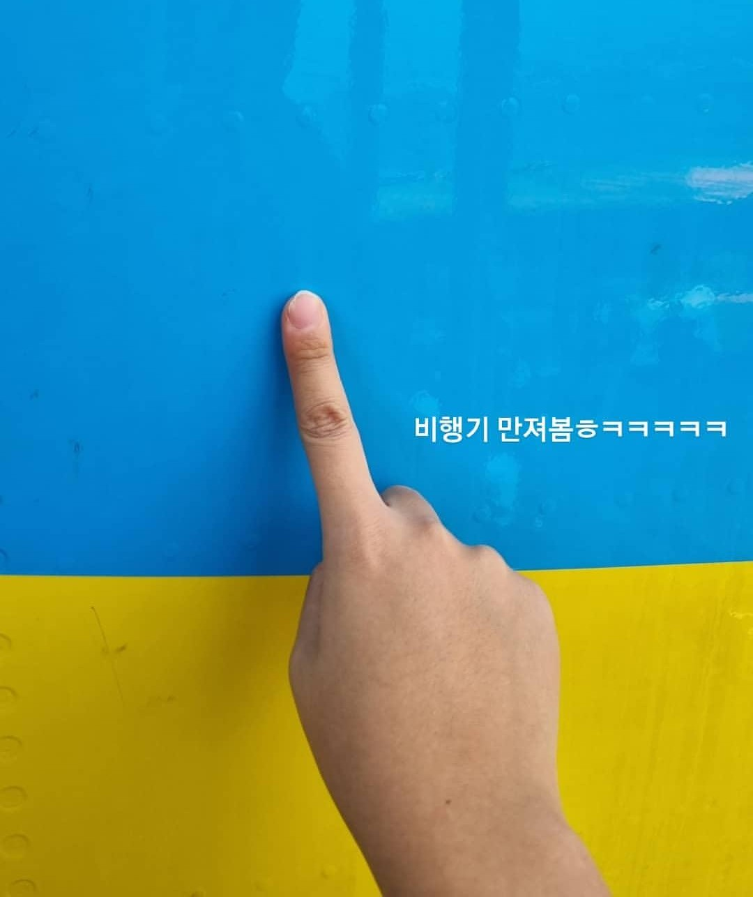
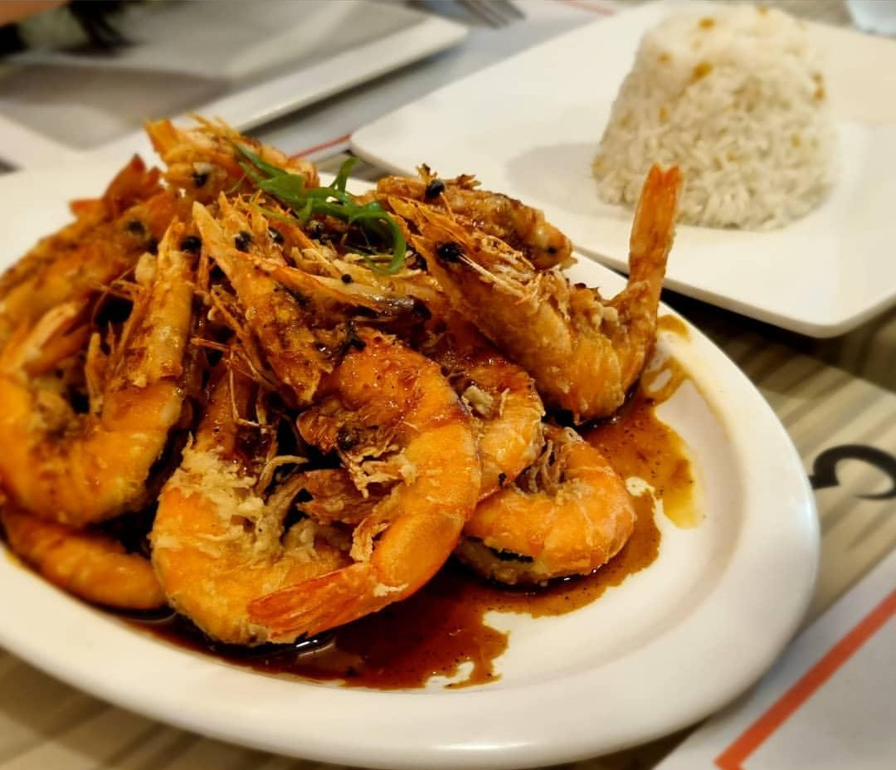

<link rel="stylesheet" href="https://cdnjs.cloudflare.com/ajax/libs/font-awesome/6.4.0/css/all.min.css">
<link href="https://fonts.googleapis.com/css2?family=Inter:wght@400;600&family=Noto+Sans+KR:wght@400;600&display=swap" rel="stylesheet">

  

    <aside class="sidebar">
      
교육

      <a href="index.html" class="home-btn" title="홈으로">
        <i class="fa-solid fa-house"></i>
      </a>
    </aside>
    <main class="main-content">

      <section class="bottom-content">
        

          <i class="fa-solid fa-plane"></i> 필리핀
          <i class="fa-solid fa-calendar"></i> 겨울 방학
          <i class="fa-solid fa-clock"></i> 한 달
        

          

            

              <i class="fa-solid fa-magnifying-glass"></i>
              <input type="text" placeholder="검색어를 입력하세요">
            

            <h4>자주 찾는 검색어:</h4>
            
어학연수 / 필리핀 / 여행 / 공부 / 추억

          

        

            
            
<i class="fa-solid fa-camera" style="margin-right:6px;font-size:0.7rem;"></i> 비행기 만져보기

          

            
            
<i class="fa-solid fa-utensils" style="margin-right:6px;font-size:0.7rem;"></i> 가서 먹은 음식

          

        

        

          어학연수 이야기
          
대학교 1학년 겨울 방학 동안 한 달간 필리핀에서 어학연수를 다녀왔습니다. 새로운 경험과 추억이 가득한 시간이었습니다.

        

      </section>
      <footer class="footer">
        
2026 PORTFOLIO

        

          <i class="fa-solid fa-caret-left"></i>
          01
          <i class="fa-solid fa-caret-right"></i>
        

      </footer>
    </main>
  

